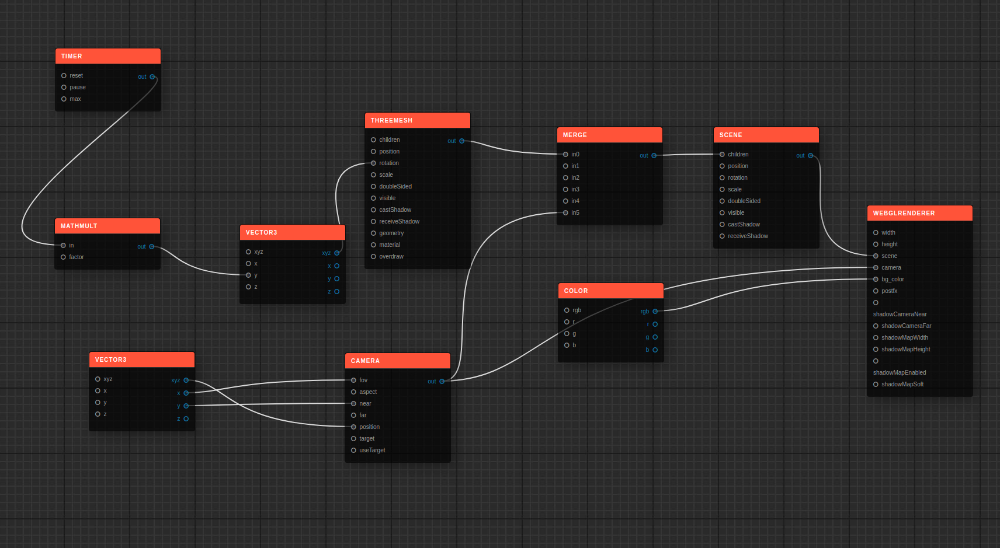

# Naph

## Experimental - _Use at your own peril!_

<p align="center">
  
</p>

[](https://badge.fury.io/js/naph)
[](https://gitpod.io/#https://github.com/williamluke4/Naph)
=======


## Install

#### NPM:

```sh
npm install --save naph
```

## Usage

```jsx
import NaphGraph, { NaphProvider } from "naph";

const example = {
  nodes: [
    {
      nid: 1,
      title: "User",
      x: 50,
      y: 50,
      fields: [
        { name: "id", type: "@id" },
        { name: "firstname", type: "String" },
        { name: "surname", type: "String" },
        { name: "posts", type: "Post[]" },
        { name: "comments", type: "Comment[ ]" }
      ]
    },
    {
      nid: 3,
      title: "Comment",
      x: 500,
      y: 300,
      fields: [
        { name: "id", type: "@id" },
        { name: "post", type: "Post" },
        { name: "user", type: "User" },
        { name: "data", type: "String" }
      ]
    },
    {
      nid: 2,
      title: "Post",
      x: 400,
      y: 100,
      fields: [
        { name: "id", type: "@id" },
        { name: "user", type: "User" },
        { name: "comments", type: "Comment[]" },
        { name: "data", type: "String" }
      ]
    }
  ],
  connections: [
    {
      from_node_id: 1,
      from_field_name: "posts",
      to_node_id: 2,
      to_field_name: "user"
    },
    {
      from_node_id: 1,
      from_field_name: "comments",
      to_node_id: 3,
      to_field_name: "user"
    },
    {
      from_node_id: 2,
      from_field_name: "comments",
      to_node_id: 3,
      to_field_name: "post"
    }
  ]
};

export const Naph = () => (
  <NaphProvider data={example}>
    <NaphGraph
      onNodeMove={(nid, pos) => onNodeMove(nid, pos)}
      onNodeStartMove={nid => onNodeStartMove(nid)}
      onNewConnector={(n1, o, n2, i) => onNewConnector(n1, o, n2, i)}
      onRemoveConnector={connector => onRemoveConnector(connector)}
      onNodeSelect={nid => {
        handleNodeSelect(nid);
      }}
      onNodeDeselect={nid => {
        handleNodeDeselect(nid);
      }}
    />
  </NaphProvider>
);
```
